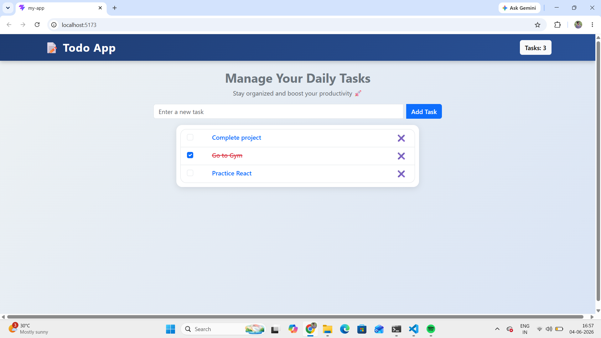

## 🚀 Live Demo

https://todo-app-phi-steel-14.vercel.app/

# 📝 Todo App

A modern and responsive Todo Application built with React and Bootstrap. Users can add tasks, mark them as completed, and delete tasks through a clean and intuitive interface.

## 🚀 Features

* Add new tasks
* Mark tasks as completed
* Delete tasks
* Responsive design for mobile, tablet, and desktop
* Modern and user-friendly UI
* Component-based React architecture

## 🛠️ Technologies Used

* React.js
* JavaScript (ES6+)
* HTML5
* CSS3
* Bootstrap 5
* Vite

## 📦 Installation

Clone the repository:

```bash
git clone https://github.com/Sumanth-yadav18/TODO-APP.git
```

Install dependencies:

```bash
npm install
```

Start the development server:

```bash
npm run dev
```

## 📸 Screenshot



## 📚 What I Learned

* React Components
* Props
* State Management with useState
* Event Handling
* Conditional Rendering
* Responsive Design using Bootstrap
* CSS Modules

## 👨‍💻 Author

**G Sumanth**
